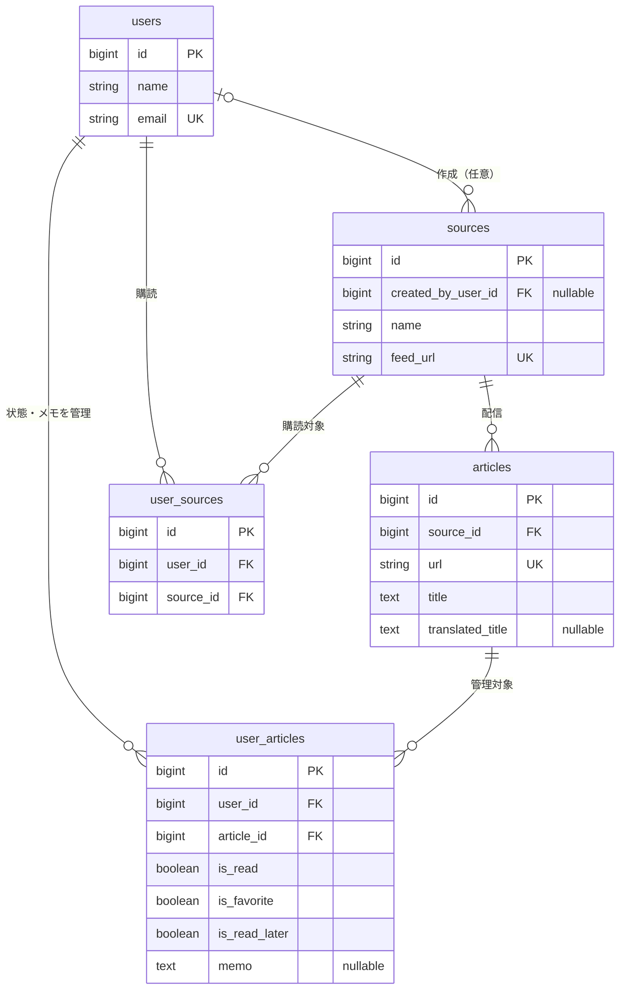

[](https://github.com/nasu-masa/tech-news-aggregator/actions/workflows/ci.yml)

## ◎ アプリ概要・制作目的

**tech-news-aggregator（テクっと）** は、RSS / Atomで配信されるテックニュースを収集・整理するWebアプリケーションです。複数サイトの情報を一か所で確認し、購読・既読管理・お気に入り・メモで、日々の情報収集と読み返しを支援します。

## ◎ 主な機能

### ◇ 認証・アカウント

- ユーザー登録、ログイン・ログアウト、メール認証、パスワードリセット
- 名前・メールアドレス・パスワードの変更、パスワード確認付きの退会
- 記事・ソースAPIはログインとメール認証が必要

### ◇ ソース・記事管理

- 共通ソースの購読・解除、HTTPSのRSS / Atom URLによるソース追加
- カスタムRSSの購読は1ユーザー最大3件。共通ソース・非アクティブなソースは上限に含めず、購読解除で枠が空きます
- 有効な共通ソースは購読者なしでも常時（1時間ごとに）取得。カスタムRSSは購読者がいる間だけ取得し、新規登録時にも取得ジョブを投入
- 記事一覧・詳細・配信元へのリンク、20件単位のページネーション
- 原文／翻訳タイトル・原文／翻訳概要のキーワード検索、ソース・未読／既読・お気に入り・あとで読むによる絞り込み
- ユーザーごとの記事状態とメモ（最大5,000文字）の保存
- DeepLによる新規記事のタイトル・概要の日本語翻訳（API設定が必要）
- PC・モバイル向けのレイアウト、お問い合わせ先・プライバシーポリシーの表示

## ◎ 使用技術

| 分類 | 技術 |
|---|---|
| フロントエンド | React 19 / TypeScript 6 / Vite 8 / Tailwind CSS 4 |
| 画面遷移・通信・フォーム | React Router 7 / Axios / React Hook Form |
| バックエンド | Laravel 13 / PHP 8.4（Docker）/ Sanctum / Fortify |
| データベース | PostgreSQL 17 |
| キャッシュ・キュー | Redis 7 |
| フィード解析・翻訳 | laminas/laminas-feed / DeepL API |
| 実行環境 | Docker Compose / Nginx 1.27 / Node.js 22（ビルド・開発）|
| テスト・静的チェック | PHPUnit 12 / SQLite（通常テスト）/ Oxlint / TypeScript / GitHub Actions q|
| 開発用メール | MailHog |

## ◎ システム構成

```text
ブラウザー → React SPA → Nginx → Laravel API（PHP-FPM）
                                  ├─ PostgreSQL：記事・ユーザー・購読・セッション
                                  ├─ Redis：キャッシュ・ジョブキュー
                                  └─ SMTP：認証・パスワードリセットメール

scheduler → feeds:import → Redis → queue-worker → RSS / Atom取得・記事保存
                                             └→ DeepLタイトル・概要翻訳
```

ローカルはVite、本番はNginxがSPAを配信します。DBとRedisには永続ボリュームを使用し、フィード取得・翻訳はキューで非同期処理します。

ソース・記事を共有データとして保存し、購読や記事の状態・メモはユーザーごとに管理します。

### ◇ ER図

主要5テーブルの関係と代表的なカラムを示しています（共通日時などは省略）。



`user_sources`はユーザーと配信元、`user_articles`はユーザーと記事の組み合わせをそれぞれ一意にし、購読・状態の重複登録を防ぎます。

## ◎ ローカル環境構築手順

### ◇ 前提・環境変数

DockerとDocker Composeを用意し、以下をリポジトリのルートで実行します。ホストへのPHP・Node.jsのインストールは不要です。既存の`.env`がある場合は上書きせず内容を確認してください。

```bash
cp .env.example .env
cp backend/.env.example backend/.env
cp frontend/.env.example frontend/.env
```

環境変数例はローカル用です。DB接続情報を変更する場合は、ルートと`backend/.env`の設定を一致させてください。ポート変更は`compose.yml`で行います。

### ◇ 起動・初期設定

依存関係とDBの準備を終えてから、画面とバックグラウンド処理を起動します。

```bash
docker compose up -d --build backend
docker compose exec backend composer install
docker compose exec backend php artisan key:generate
docker compose exec backend php artisan migrate

# 共通のニュースソースを登録（記事・ユーザーは作成しない）
docker compose exec backend php artisan db:seed --class=SourceSeeder

docker compose up -d --build
```

画面からユーザー登録し、MailHogでメール認証後、ソースを購読します。取得をすぐ開始する場合は次を実行します（queue-workerによる非同期処理）。

```bash
docker compose exec backend php artisan feeds:import
```

| サービス | アクセス先 |
|---|---|
| フロントエンド | http://localhost:5173 |
| バックエンド（APIは`/api/*`）| http://localhost:8000 |
| MailHog | http://localhost:8025 |

### ◇ 翻訳を利用する場合

`backend/.env`の`DEEPL_API_KEY`と`DEEPL_API_URL`を設定し、`docker compose restart queue-worker scheduler`で反映します。未設定では翻訳に失敗しますが、記事は保存され、原文タイトル・概要で閲覧できます。

翻訳Jobはタイトル・概要を個別に保存し、失敗した場合は最大3回試行します。保存済みの訳文、空の文章、ひらがな・カタカナを含む文章は翻訳を省きます。再試行では成功済みの項目を再送しません。概要がある記事は通常、タイトルに加えて概要分の1リクエストと利用文字数が増えます。API成功後のDB保存失敗などでは、再試行時に同じ文章を送る可能性があります。

`translated_summary`は初期migrationにnullableな`text`型として定義済みです。今回の追加migrationや既存記事の一括翻訳はありません。既存記事の再取得では翻訳Jobを追加しません。バックフィル・原文更新時の再翻訳は今後の対応です。反映時は通常の`php artisan migrate --force`でスキーマを確認し、`php artisan queue:restart`で常駐workerに新コードを読み込ませてください。

## ◎ Seeder・テストユーザー

| Seeder | 作成内容 |
|---|---|
| `SourceSeeder` | 共通のニュースソース13件を登録・更新。記事・ユーザーは作成しない |
| `DatabaseSeeder`（`php artisan db:seed`）| 共通ソースと認証済みユーザー`test@example.com`を作成。同一ユーザーがいる状態では再実行不可 |
| `DevelopmentSeeder` | `APP_ENV=local`専用。認証済みユーザー`dev@example.test`と、画面確認用の記事・購読・状態・メモを作成 |

両ユーザーのパスワードは`password`です。コードに定義されたローカル確認用で、公開環境用のアカウントではありません。

```bash
# 外部通信なしで画面を確認する場合
# 架空フィードへの定期アクセスを避けるためschedulerを停止
docker compose stop scheduler
docker compose exec backend php artisan db:seed --class=DevelopmentSeeder
```

開発用データは架空URLのためフィード取得には使えません。Seederの再実行で対象のデータ・購読・状態は定義値に戻ります。

## ◎ テスト方法

### ◇ バックエンド

```bash
docker compose exec backend php artisan test
# 特定のテストのみ（例）
docker compose exec backend php artisan test --filter=ArticleControllerTest
```

`backend/phpunit.xml`ではSQLiteのインメモリDBを使用します。APIの認証・検索・ユーザー別状態、RSS解析・取得時のSSRF対策、重複保存・ジョブ・翻訳・日時変換などを検証します。

PostgreSQL固有の日時テストは、通常のSQLite実行ではスキップされます。

### ◇ フロントエンド

```bash
docker compose exec frontend npm run lint
docker compose exec frontend npm run build
```

Oxlintと、TypeScriptの型チェックを含む本番ビルドを実行します。

### ◇ E2E（Playwright / Chromium）

ローカルDockerの画面（`localhost:5173`）と実API（`localhost:8000`）を、ホストのNode.js 22でテストします。Alpineのfrontendコンテナ内では実行しません。初回は上記の環境構築・マイグレーションを済ませてください。

```bash
# リポジトリルート：外部RSS・DeepL処理を停止
docker compose stop scheduler queue-worker
docker compose up -d frontend
cd frontend
npm ci
npx playwright install --with-deps chromium
cp .env.e2e.example .env.e2e
# .env.e2eに、上のDevelopmentSeederユーザーのメール・パスワードを設定
npm run test:e2e
```

各テスト前に`DevelopmentSeeder`を自動実行し、対象ユーザーの購読・記事状態を初期化します（`APP_ENV=local`必須）。既存DB全体の削除は行いません。専用のローカル環境で実行し、同じユーザーでの手動操作や複数のE2Eプロセスの同時実行は避けてください。認証情報は環境変数でも指定でき、`.env.e2e`はGit管理対象外です。

4ケースでログイン・一覧、キーワード検索、お気に入りの登録／解除と永続化、ログアウト後のアクセス制限、一覧・詳細の翻訳概要優先／原文表示を確認します。1 worker・リトライなしで実行し、外部へのブラウザリクエストは遮断します。scheduler / queue-workerが起動中なら開始前にエラーにします。

失敗時のスクリーンショット・traceは`frontend/test-results/`、HTMLレポートは`frontend/playwright-report/`に出力します。`npx playwright show-report`で確認できます。認証情報を含み得るため成果物の公開は避けてください。終了後、通常のフィード取得を再開する場合のみ、ルートで`docker compose start scheduler queue-worker`を実行します。

### ◇ GitHub Actions

[CI workflow](.github/workflows/ci.yml)が`push` / `pull_request`時に次の3 jobを実行します。

- **backend**：PHP 8.4でComposer依存関係をインストールし、`php artisan test`を実行。SQLiteのインメモリDBを使い、`PostgresTimezoneTest`はスキップします。
- **frontend**：Node.js 22で`npm ci`、`npm run lint`、`npm run build`を実行。npmのダウンロードキャッシュを利用します。
- **e2e**：runner内で既存ComposeのDB・Redis・MailHog・Laravel・Nginx・Viteを起動し、HTTP応答を確認後、Chromiumで上記4ケースを実行します。

CIの環境設定は`.env.example`群のローカル用ダミー値を使用し、APP_KEYは実行時に生成します。E2E認証情報はDevelopmentSeederの既存の公開ローカル用定義から読み取り、各テスト前にメール認証済みユーザー・記事・状態を初期化します（`APP_ENV=local`）。GitHub Secretsの登録は不要です。scheduler / queue-workerは起動せず、外部RSS・DeepL・SESや本番環境には接続しません。

E2E失敗時はPlaywrightレポート・スクリーンショット・traceをartifactとして7日間保存します。認証セッションを含み得るため、共有範囲に注意してください。初回実行では3 jobの成功、Dockerの起動とマイグレーション、E2Eの4件成功を確認してください。ローカル実行方法は上記のE2E手順を参照してください。

## ◎ ディレクトリ構成

```text
tech-news-aggregator/
├── backend/
│   ├── app/              # API、モデル、フィード処理、ジョブ、認証処理
│   ├── config/           # DB・認証・CORS・外部サービス設定
│   ├── database/         # マイグレーション、Factory、Seeder
│   ├── resources/views/  # 認証メールなどのテンプレート
│   ├── routes/           # API・Webルート、定期実行設定
│   └── tests/            # Unit / Featureテスト
├── frontend/src/
│   ├── pages/            # 記事・認証・設定などの画面
│   ├── components/       # レイアウト・認証ガード・記事・ソースUI
│   ├── api/              # 記事・ソースのAPI呼び出し
│   ├── contexts/         # 認証状態管理
│   └── lib/              # HTTPクライアント、認証、日付・入力処理
├── docker/               # PHP・フロントエンド・Nginxの構成
├── compose.yml           # ローカル開発環境
└── compose.prod.yml      # 本番向け構成
```

## ◎ 設計・実装上の工夫

- **非同期処理と重複防止**：取得・解析・保存・翻訳を分離し、ジョブの重複実行と記事の重複保存を防止。
- **セキュリティ**：HTTPS制限やプライベートIP拒否などのSSRF対策、Cookie認証・CSRF対策を実装。
- **ユーザー状態の分離**：共有記事と個人の状態を別テーブルで管理し、本人の状態だけを取得・更新。
- **日時の一貫性**：UTCで保存・復元し、画面は日本時間で表示。
- **操作性**：概要の不要なHTML・メタ情報を除去し、検索条件を記事詳細から一覧に戻る際にも保持。

## ◎ 公開環境

公開URL：[https://tekutto-news.com](https://tekutto-news.com)

| 用途 | 構成 |
|---|---|
| ホスティング | AWS Lightsail / Docker Compose |
| Web配信 | Nginx + HTTPS |
| メール | Amazon SES（認証・パスワード再設定）|
| 翻訳 | DeepL API（新規記事のタイトル・概要）|
| ログ・監視 | CloudWatch（Laravel / Nginxログ、CPU・メモリ・ディスク）|

### ◇ 利用上の制限

- 記事・ソースの利用にはメール認証が必要です。
- 取得は毎時、各ソース1回につき最大30記事。有効な共通ソースは常時取得し、カスタムRSSは購読者がいる間だけ取得します。
- カスタムRSSの購読上限は1ユーザー3件（有効なソースのみ）。共通ソースは対象外です。
- DeepL全体の月間文字数上限は未実装です。購読制限だけで翻訳利用量の上限が保証されるものではありません。
- 翻訳は新規記事のタイトルと空でない概要が対象です。本文は翻訳しません。検索対象は原文タイトル・翻訳タイトル・原文概要・翻訳概要です（キーワードは255文字以内）。
- 一覧・詳細には日本語訳の概要を優先表示し、未翻訳なら原文概要を表示します。原文はDBに保持し、全文は配信元で閲覧します。

## ◎ 今後の改善項目

以下は未実装・今後の検討事項です。

### ◇ 品質保証

* フロントエンドの自動テストの拡充

### ◇ 翻訳機能

* 翻訳失敗・利用量の管理
* DeepL全体の月間文字数上限の導入
* 既存の未翻訳記事のバックフィル・原文更新時の再翻訳

### ◇ 運用

* 本番環境のデプロイ・障害対応手順のドキュメント化

### ◇ 将来構想

* Pro構想：Free / Proプラン、決済連携、購読上限・取得頻度などの限定機能
